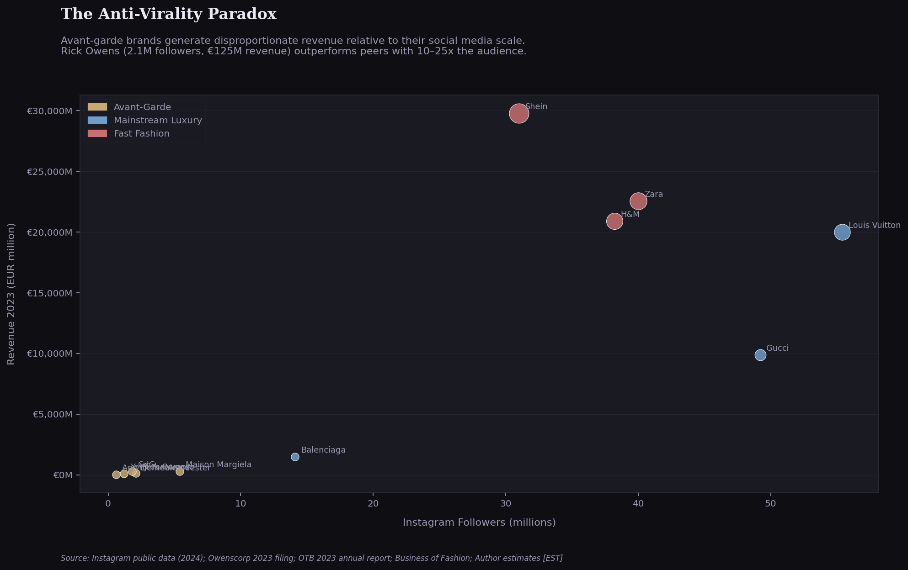

# The Durability Paradox
### How Avant-Garde Fashion Brands Outlast the Brands That Outspend Them

**Omar Oudrari** · JMU College of Business · CIS + Marketing · Business Analytics Concentration · 2025–2026

---

## Overview

A multi-deliverable business analysis project examining the financial durability of avant-garde fashion brands against two structural foils: mainstream luxury conglomerates and fast fashion operators.

**Central thesis:** Scarcity, mystique, and designer authorship create brand moats that volume-dependent luxury and trend-dependent fast fashion structurally cannot replicate, making avant-garde brands some of the most durable businesses in fashion despite never chasing scale.

---

## Brands Studied

| Tier | Brands |
|------|--------|
| **Avant-Garde** | Rick Owens · Maison Margiela · Comme des Garçons · Yohji Yamamoto · Ann Demeulemeester · Helmut Lang (archive) |
| **Mainstream Luxury** | Louis Vuitton · Gucci · Balenciaga |
| **Fast Fashion** | Zara · H&M · Shein |

---

## Deliverables

| File | Description |
|------|-------------|
| `analysis.py` | Full Python analysis - 8 publication-quality charts |
| `luxury_fashion_master.csv` | Master dataset: 12 brands × 18 variables |
| `durability_paradox_dataset.xlsx` | Formatted Excel workbook with sources & methodology |
| `durability_paradox.pptx` | 15-slide academic presentation |
| `durability_paradox_report.docx` | 8-section written research report |
| `PowerBIAvantGarde.pbix` | 5-page interactive Power BI dashboard |

---

## Analysis Modules

1. **The Anti-Virality Paradox** — Revenue vs. Instagram followers. Rick Owens: 2.1M followers, €125M revenue. Shein: 31M followers, €29.8B revenue. The ratio is inverted — and intentional.

2. **Resale Value Retention** — Maison Margiela retains 82% of retail value on secondary markets. Shein retains effectively 0%. The secondary market is a leading indicator of brand durability.

3. **The Archive Premium** — Helmut Lang's archive (1986–2004) trades at 300–400% above original retail prices, 20 years after the designer stopped designing. Martin Margiela archive pieces realized €341,750 at Sotheby's in 2019.

4. **Revenue Growth 2023** — Maison Margiela +23%. Rick Owens +18%. Balenciaga -15%. Gucci -6%. Avant-garde brands outperform mainstream luxury on a median basis.

5. **Distribution Strategy** — Comme des Garçons (~70% DTC via Dover Street Market) controls the entire customer relationship. OTB reported Margiela's DTC channel grew 33.8% in 2023.

6. **Ethics & The Regulatory Illusion** — Fashion Transparency Index scores measure EU regulatory compliance, not ethical performance. Avant-garde brands score near zero because they are too small to be included in the 250-brand sample — not because of unethical practices.

7. **Price Positioning** — Avant-garde brands occupy a distinct quadrant: moderate retail price, maximum resale retention. Fast fashion is cheap and worthless on resale. Mainstream luxury is expensive but retains less than expected.

8. **Longevity Matrix** — Comme des Garçons: 56 years of independent operation. Yohji Yamamoto: survived 2009 bankruptcy, continued producing. The designer-as-auteur model creates irreplaceable identity.

---

## Dataset

**12 brands · 18 variables · Source classification: PRIMARY / ARCHIVAL / DERIVED / AGGREGATED**

Variables include: revenue (€M), revenue growth YoY, employees, flagship stores, Instagram followers, ownership structure, DTC %, Fashion Transparency Index score, Good On You rating, average jacket price (USD), resale retention %, archive premium %, years of operation, bankruptcy history.

**Key sources:** Owenscorp Italia S.p.A. 2023 filing · OTB Group 2023 & 2024 Annual Reports · LVMH 2023 Annual Report · Kering 2023 Results · Fashion Revolution FTI 2023 · Vestiaire Collective Q4 2024 · Grailed sold listings · Sotheby's Martin Margiela 2019 sale · Business of Fashion

---

## Tech Stack

`Python` `Pandas` `Matplotlib` `Seaborn` `Power BI` `Excel (openpyxl)` `PowerPoint (pptxgenjs)`

---

## Key Findings

1. Scarcity is a financially viable strategy at meaningful scale - Rick Owens proves €125M is achievable without advertising
2. Social media reach is inversely correlated with brand durability indicators
3. The secondary market is the most reliable leading indicator of brand health
4. Fashion Transparency Index scores measure regulatory compliance, not ethical performance
5. The designer-as-auteur model creates irreplaceable competitive moats that no conglomerate can acquire

---

## Connect

[LinkedIn](https://www.linkedin.com/in/omaroudrari/) · [Portfolio](https://yrgomar.github.io) · omar.oudrari@gmail.com
